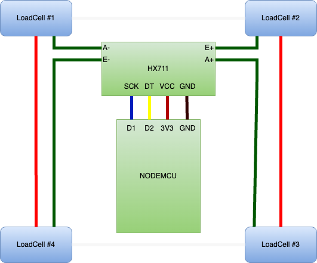

# KegKeeper 

"KegKeeper" is really just a silly name for a DIY digital scale that we can build relatively cheap and integrate with third-party applications like Home Assistant, Bar Helper or any applications that offers an API where we can push the current weight of our kegs. 

If you fancy this project and would like to support this and future projects I would really appreciate a cup of coffee 😃 

Check out my page here https://www.buymeacoffee.com/Y3bqWk1

## How to build

I've made a video that shows how to build, wire up and configure KegKeeper so that it can be integrated with Bar Helper. The video is in Norwegian, but should provide enough information to build the scale even for non-Norwegians 👍😃🇳🇴. The dialect I'm speaking is "Trøndersk" so don't worry if you don't understand a thing. Many Norwegians don't understand it either 😃.

https://www.youtube.com/watch?v=wA3IK3HbGcs

## Parts list 

Note that the prices will be in NOK (Norwegian Kroner) including shipping to Norway as of today June 6, 2023.

| Description    | Link                                                                                                         |  Price |
| -------------- | ------------------------------------------------------------------------------------------------------------ | -----: |
| Load cells     | https://www.aliexpress.com/item/1005002176327047.html?spm=a2g0o.order_list.order_list_main.61.21ef1802O5rDSI | 50 NOK |
| NodeMCU (8266) | https://www.aliexpress.com/item/32520574539.html?spm=a2g0o.order_list.order_list_main.71.21ef1802O5rDSI      | 37 NOK |

In addition to this we need some [brackets](https://www.thingiverse.com/thing:2624188/files) to hold the load cells in place. If we don't have access to a 3D-printer, there are plenty of websites that offers printing. For instance [PCBWay](https://www.pcbway.com/)


## Wiring diagram

Please note that the colors of the wires may be different than in the video and the colors used in this wiring diagram. 



## Configuring Tasmota 

Please refer to the video to see how we configure the Generic(18) module and the HX711 sensor.

We will be using the Tasmota console to do the following configurations.

### Weighres

The default weight resolution in Tasmota is 0 so we can set this to 3 to enable three decimals in the reported weight. 

```
weightres 3
```

### TelePeriod

This is the period to wait before we report the weight up to BarHelper. There is no need to report this value too often so setting it to 60 seconds could be a reasonable default.

```
TelePeriod 60
```

> Note that ideally we should not publish the weight unless the delta from the previous reading is above a given threshold, but since we are using the Tasmota Sensors precompiled binary here, there is no support for math functions. We need to compile our own version for that and that is sort of next level and perhaps a topic for another video. 

### Publishing to BarHelper 

For the weight to be reported to BarHelper, we need to set up a rule for that in Tasmota. 

The rule looks like this.

```
RULE1 ON Tele-HX711#Weight DO WebQuery http://europe-west1-barhelper-app.cloudfunctions.net/api/customKegMon POST [authorization:REPLACE_THIS_WITH_THE_APIKEY_FROM_BARHELPER|Content-Type:application/json]{"name":"REPLACE_THIS_WITH_THE_NAME_OF_THE_KEGMONITOR","volume":%value%,"type":"l"} ENDON
```

Yeah, I know. I looks a little bit wierd, but the only thing we need to change is the API-KEY we get from BarHelper and the name of our keg monitor. 

